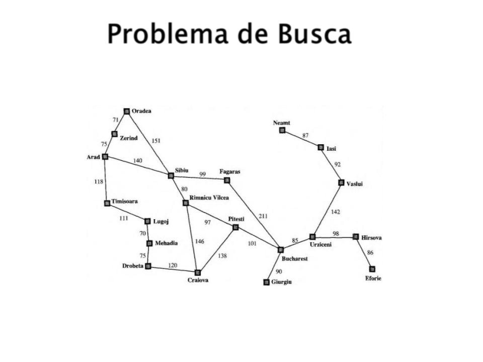
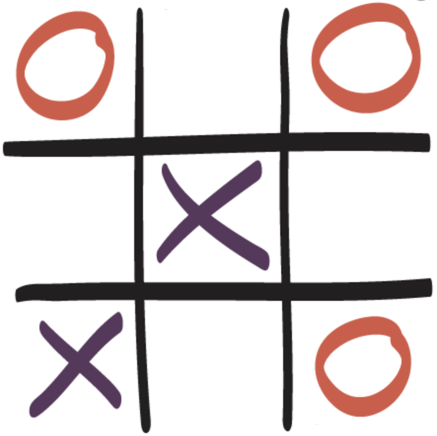

# Componentes de Um Problema
- Estado Inicial
- Estado final (objetivo)
- Espaço de estados (possibilidades possíveis)
- Ações para passar de um estado para outro
- Solução (caminho que leva do estado iniciao ao estado final)          

## Problemas

### Problema: Ir de Arad até Bucharest
        

### Problema: Jogo Das Peças (8-Puzzle)
            

### Problema: Jogo da Velha         

# Heurísticas
Técnicas simplificadas e eficientes que são usadas para encontrar soluções aproximadas ou satisfatórias em situações.